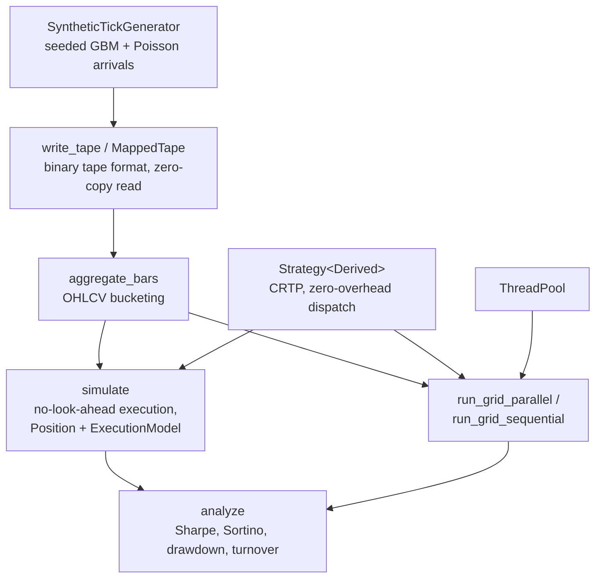

# tapebench

> A C++20 event-driven backtesting and strategy-simulation engine — zero-overhead
> CRTP strategy dispatch, a structurally-enforced no-look-ahead execution model,
> zero-copy memory-mapped tick I/O, and concurrent parameter-grid backtesting via a
> thread pool built from scratch.

[](https://github.com/emmanueladutwum123/tapebench/actions/workflows/ci.yml)


**What / Why / Results (30-second version)**

- **What:** generates a synthetic tick tape, writes it to a custom binary format, reads
  it back via zero-copy `mmap`, aggregates it into OHLCV bars, runs one or many trading
  strategies against those bars through an event-driven simulator (with slippage and
  average-cost P&L accounting), computes Sharpe/Sortino/max-drawdown, and can run an
  entire parameter grid of strategies in parallel across a hand-built thread pool.
- **Why it's different:** every performance claim is backed by a committed benchmark
  (`bench/`), not an estimate — including a direct, isolated measurement of what CRTP
  static dispatch actually saves over virtual dispatch. Every correctness claim is
  backed by a test that would actually fail if it were wrong: the "zero-copy" claim is
  verified by a test that overrides global `operator new` and asserts 0 allocations;
  the "no look-ahead" claim is structurally enforced by the simulation loop itself, not
  just documented; parallel and sequential backtest runs are asserted to produce
  byte-identical results, and the full suite runs clean under ThreadSanitizer in a
  dedicated CI job. See [`DESIGN.md`](DESIGN.md) for the full reasoning behind every
  significant decision, including a table of real bugs this process caught.
- **Results:** CRTP dispatch **~3.1x faster** than virtual dispatch (0.289ns vs.
  0.888ns/call, isolated so the comparison is fair); zero-copy tape iteration at
  **~822M ticks/second**; parallel parameter-grid backtesting at a genuine **~3.8x
  wall-clock speedup** on 8 logical cores, with results proven byte-identical to a
  sequential run. Full methodology and every number — see
  **[`BENCHMARKS.md`](BENCHMARKS.md)**.

## Contents

- [Architecture](#architecture)
- [Status](#status)
- [Quickstart](#quickstart)
- [Why a synthetic tick generator](#why-a-synthetic-tick-generator)
- [What's inside](#whats-inside)
- [Design principles](#design-principles)
- [License](#license)

## Architecture



Single-strategy runs go `bars -> simulate -> analyze` directly. Parameter-grid runs
route through `run_grid_parallel`/`run_grid_sequential` instead, which call
`simulate`+`analyze` once per strategy instance — across the thread pool or one at a
time — and are asserted to produce identical results either way (see
[`DESIGN.md`](DESIGN.md#the-thread-pool-built-from-scratch-not-stdasync)).

## Status

Built milestone by milestone, all eight complete.

| Milestone | Scope | State |
|-----------|-------|-------|
| M1 | Repo skeleton, CMake, CI (gcc+clang, Debug+ASan/UBSan, Release) | ✅ |
| M2 | Zero-copy tick/bar data pipeline (binary tape format, `MappedTape`, `aggregate_bars`) | ✅ |
| M3 | CRTP strategy interface + two example strategies (trend-following, mean-reverting) | ✅ |
| M4 | Event-driven simulation core: no-look-ahead execution, slippage, P&L accounting | ✅ |
| M5 | Performance analytics: Sharpe, Sortino, max drawdown, turnover | ✅ |
| M6 | Concurrent parameter-grid backtesting via a custom thread pool + dedicated TSan CI job | ✅ |
| M7 | Google Benchmark suite + `BENCHMARKS.md` (real, captured numbers) | ✅ |
| M8 | Polished README, architecture diagram, `DESIGN.md` | ✅ |

## Quickstart

```bash
# Build + test (Debug, sanitizer-clean)
cmake -S . -B build -DCMAKE_BUILD_TYPE=Debug -DTB_ENABLE_ASAN=ON -DTB_ENABLE_UBSAN=ON
cmake --build build -j
./build/tapebench_demo
ctest --test-dir build --output-on-failure

# Benchmarks (Release, no sanitizers -- their overhead would make the numbers meaningless)
cmake -S . -B build-bench -DCMAKE_BUILD_TYPE=Release -DTB_BUILD_BENCHMARKS=ON
cmake --build build-bench -j
./build-bench/bench/tapebench_bench_dispatch       # CRTP vs. virtual dispatch
./build-bench/bench/tapebench_bench_parallel_grid  # sequential vs. parallel speedup
```

## Why a synthetic tick generator

Real tick-level market data isn't reliably licensable or scriptable for a *public* CI
pipeline. Every milestone here is built and tested against a seeded, deterministic
synthetic tape instead — a GBM-style price path with Poisson-process inter-arrival
times — so the test suite has no external data dependency and is fully reproducible.
Full reasoning in [`DESIGN.md`](DESIGN.md#why-a-synthetic-tick-generator-not-real-market-data).

## What's inside

| Component | File(s) | What it does |
|---|---|---|
| `Tick` | `include/tapebench/tick.hpp` | Flat, trivially-copyable trade-print type every later component builds on. |
| `SyntheticTickGenerator` | `include/tapebench/synthetic_generator.hpp`, `src/synthetic_generator.cpp` | Deterministic, seeded synthetic trade tape: GBM price path, Poisson-process arrival times, order-flow-biased trade side. |
| Tape format | `include/tapebench/tape_format.hpp` | On-disk layout: a small header immediately followed by contiguous `Tick` records — no compression or variable-length encoding, so it can be memory-mapped and reinterpreted directly. |
| `write_tape` | `include/tapebench/tape_writer.hpp`, `src/tape_writer.cpp` | Serializes a tick tape to disk in that format. |
| `MappedTape` | `include/tapebench/mapped_tape.hpp`, `src/mapped_tape.cpp` | Memory-maps a tape file and exposes its ticks as a `std::span<const Tick>` pointing directly into the mapping — **zero heap copy on the read path, verified** by a dedicated allocation-counting test. Move-only; throws on a missing/truncated/malformed file. |
| `Bar` / `aggregate_bars` | `include/tapebench/bar.hpp`, `include/tapebench/bar_aggregator.hpp`, `src/bar_aggregator.cpp` | Aggregates a tick tape into fixed-duration OHLCV bars, single pass, skipping empty buckets. |
| `Strategy<Derived>` | `include/tapebench/strategy.hpp` | CRTP base for **compile-time, zero-overhead strategy dispatch**, constrained by a C++20 concept (`StrategyImpl`) so a malformed strategy fails to compile with a specific message. `run_over_bars()` is a generic driver proven to work identically for any conforming strategy. |
| `MovingAverageCrossover` | `include/tapebench/strategies/moving_average_crossover.hpp` + `.cpp` | Example trend-following strategy: long when the fast close average is above the slow one, short otherwise. |
| `MeanReversion` | `include/tapebench/strategies/mean_reversion.hpp` + `.cpp` | Example mean-reverting strategy: rolling z-score of closes, long/short on large deviations. |
| `Position` | `include/tapebench/position.hpp`, `src/position.cpp` | Average-cost position accounting, including the reversal case (a fill larger than the current position closes it and opens the opposite side at the fill price). |
| `ExecutionModel` | `include/tapebench/execution_model.hpp` | Configurable basis-points slippage against a reference price. |
| `simulate()` | `include/tapebench/simulation.hpp` | The event-driven core: a **structurally-enforced no-look-ahead rule** — a signal from bar N's close only fills at bar N+1's open. Returns a per-bar equity curve, final position, fill count, and traded quantity. |
| `analyze()` | `include/tapebench/analytics.hpp`, `src/analytics.cpp` | Sharpe/Sortino (on bar-over-bar absolute PnL changes — see [`DESIGN.md`](DESIGN.md#sharpesortino-on-absolute-pnl-not-percentage-returns) for why), max drawdown, turnover, optional annualization. |
| `ThreadPool` | `include/tapebench/thread_pool.hpp`, `src/thread_pool.cpp` | A thread pool built from scratch: mutex + condition-variable task queue, `std::packaged_task`/`std::future` results, idempotent shutdown. |
| `run_grid_parallel` / `run_grid_sequential` | `include/tapebench/parallel_backtest.hpp` | Runs a batch of strategies through `simulate()`+`analyze()`, preserving input order. Correctness proven byte-identical between the two, clean under TSan. |
| `bench/` | 6 executables (`-DTB_BUILD_BENCHMARKS=ON`) | Google Benchmark suite: CRTP-vs-virtual dispatch, tick generation, mmap-tape iteration, bar aggregation, `simulate()` throughput, sequential-vs-parallel grid backtesting at real scale. |
| Demo | `src/main.cpp` | Full pipeline end to end: generate → write → mmap-read → aggregate → simulate both example strategies → run a 9-variant parameter grid sequentially and in parallel, confirming the results match. |

74 unit tests across 2 test executables (`tapebench_tests`, `tapebench_zero_copy_tests`),
all passing clean under AddressSanitizer + UndefinedBehaviorSanitizer (73 of them also
run clean under a dedicated ThreadSanitizer CI job — `tapebench_zero_copy_tests` is
excluded there for a documented reason, see [`DESIGN.md`](DESIGN.md#bugs-the-process-caught)).
See [`DESIGN.md`](DESIGN.md) for what each milestone's tests actually cover and the real
bugs the process caught along the way.

## Design principles

- **Measure everything.** Every performance claim in this README and `BENCHMARKS.md` is
  backed by a committed, runnable benchmark — not an estimate.
- **Prove, don't assume.** The zero-copy claim, the no-look-ahead guarantee, and the
  parallel/sequential equivalence are each backed by a test specifically designed to
  fail if the claim were false.
- **Own every design decision well enough to defend it.** `DESIGN.md` records the
  alternatives considered and rejected, not just the final choice.
- **Repo hygiene:** CI badge, architecture diagram, `DESIGN.md`, `BENCHMARKS.md`, and
  this README's 30-second summary — matching the bar set by this portfolio's other
  projects.

## License

MIT — see [`LICENSE`](LICENSE).
